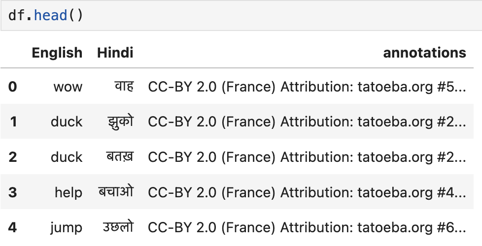

# Transformers & Attention
The repository is meant to understand how attention model works. I plan to implement the basic structure of attention and transformer model from the paper [Attention is all you need](https://papers.nips.cc/paper/2017/file/3f5ee243547dee91fbd053c1c4a845aa-Paper.pdf)

## To-Do
- [X] Implementation of the transformer from the paper.
    - [X] Positional Encoding
    - [X] Multi-head Attention 
    - [X] Encoder Decoder 
    - [X] Transformer architecture
- [ ] Basic Examples to train :
    - [X] NLP tasks
    - [ ] Time series model to train as auto-regressive

# Example : Neural Machine Translation (English -> Hindi)
I wanted to see if the transformer-model I created works on some simple tasks like translation task or not?   
Link to code : [Translation](Translation.ipynb)   
## Dataset
I used a Eng-Hin paired sentences that can be found at the link : [Dataset](http://www.manythings.org/anki/). I used Hindi since I understand the language and was easier to experiment with : )     
The dataset looks something like this :  
  
It consists of around 2979 paired sentences i.e. the English sentence and its corresponding sentence in Hindi. This needed some preprocessing (I don't think it did anything with the hindi words and punctuations though) such as :
* Removing punctuations
* Lower case
 
## Model
I used the transformer architecture that was being built. I added the positional encoding and some masking as well that is specific to this problem (we don't want attention to padding or the loss to use the padding)

Some parameters of the models: 
* \# Stacks in encoder-decoder : 6
* Multi-head attention : 4
* Dimension : 512
* Query-Key dimension : 256

Currently, running this on mps is reallyyyy slow which I think is happening because of matrix multiplication since I am able on cuda, its still faster than cpu.  
Moreover, currently only the training part of the model is present where we do something called teacher forcing. In teacher forcing, instead of using the translated word i.e. in Hindi from the decoder as an input to the next translated word, the actual word is used. However, during prediction, this part becomes auto regressive. The output of the decoder is fed in the next translation of the word. 

## Results
The result for one of the cases (that is still from the training set) is :  
  
The attention across the 4 heads for multi-head attention in the encoder-decoder attention is shown below :  
