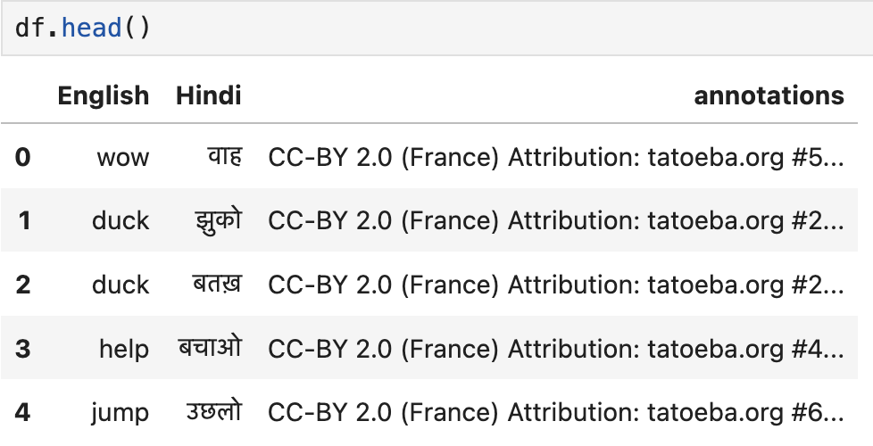

# Positional Encodings
The positional embedding generated using the $\sin$ and $\cos$ functions.  
Link to the code [Positional Encoding.ipynb](PositionalEncoding.ipynb)  

# Multi-head Attention 
Scaled dot-product attention is implemented in a multi-head attention mechanism.  
Link to the code [Multi Head Attention](Attention.ipynb)  

# Transformer Architecture
Builduing the encoder and decoder comprising of the multi-head attentions and the fc layers.   
Link to the code [Encoder Decoder stack](EncoderDecoder.ipynb)

# Example : Neural Machine Translation
I wanted to see if the transformer-model I created works on some simple tasks like translation task or not?   
Link to code : [TranslationTask](TranslationTask.ipynb)   
## Dataset
I used a Eng-Hin paired sentences that can be found at the link : [Dataset](http://www.manythings.org/anki/). I used Hindi since I understand the language and was easier to experiment with : )     
The dataset looks something like this :  
  
It consists of around 2979 paired sentences i.e. the English sentence and its corresponding sentence in Hindi. This needed some preprocessing (I don't think it did anything with the hindi words and punctuations though) such as :
* Removing punctuations
* Lower case
 
## Model
I used the transformer architecture that was being built. I added the positional encoding and some masking as well that is specific to this problem (we don't want attention to padding or the loss to use the padding)

Some parameters of the models: 
* \# Stacks in encoder-decoder : 3
* Multi-head attention : 4
* Dimension : 256

The current implementation is really slow. It uses a for loop in the multi-head attention which I think slows down computation over GPU. Moreover, currently only the training part of the model is present where we do something called teacher forcing. In teacher forcing, instead of using the translated word i.e. in Hindi from the decoder as an input to the next translated word, the actual word is used. However, during prediction, this part becomes auto regressive. The output of the decoder is fed in the next translation of the word. 

## Results
The result for one of the cases (that is still from the training set) is :  
  
The attention across the 4 heads for multi-head attention in the encoder-decoder attention is shown below :  

# Next Steps
There are couple of things I want to try on:  
- [ ] Transformer Model  
    - [ ] Inference part of the model is pending
    - [ ] Making things efficient. It seems that making the multi-head attention parallelizable is not so trivial. A couple of people have written posts about it.  
    - [ ] Clean up the code 
    - [ ] Make a model file.  